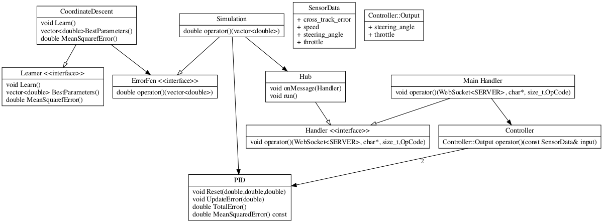

# PID-Control Project

## Software Design

## Reflections

* **P**: High values caused oscillations around the middle of road which got
  worse if car was going fast.
* **I**: Similar to **P**, mostly introduced oscillations. I was unable to find
  a good value that for using it.
* **D**: This removed some of the **P** oscillations and helped smooth out the
  turning.

## Tuning Hyper-parameters

Initially I set out to use `CoordinateDescent` to find the parameters from an
initial set of `{0,0,0}`, but this proved difficult for a three reasons.

* First, `CoordinateDescent` is a local optimizer which means you need to
  initialize it with a good value, which `{0,0,0}` is not.
* Second, initializing the coordinate perturbation parameters to `{1,1,1}`
  caused the car to drive off the track which then caused the simulator to get
  stuck.
* Third, the simulator would fail to reset sometimes meaning I would have to
  manually reset it which would take too long for algorithm to run. I also had
  trouble trying to break out of the `hub.onMessage` call and hacked it with
  throwing an exception.

After this, I gave up on `CoordinateDescent` and started tuning manually.
Initially, I tried just tuning the `steering_angle` `PID` controller but it
became clear that the car has to slow down when the `cross_tracking_error` is
high to prevent instability. I settled on a `Controller` that uses two `PID`
controllers, one for the `steering_angle` and another for the `throttle`
where the latter reduces the `target_speed` based on absolute
`cross_tracking_error`. Manual tuning was much easier from here on.
